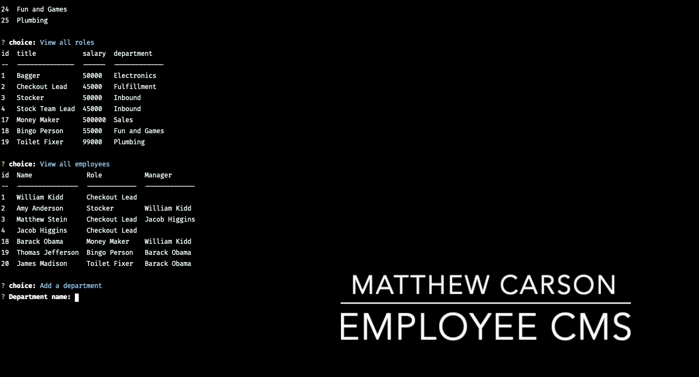

# myTeam

A simple and easy-to-use content management system for a company's employees

- Create and view employees entries
- Create and view company's departments
- Create and view department's roles
- Update an employee's manager.

## Upcoming Features

- Allow users to view employees by manager.
- Allow users to view employees by department.
- Allow users to delete departments, roles, and employees.
- Allow users to view the total utilized budget of a department—in other words, the combined salaries of all employees in that department.

## License

This application is open-sourced software and is licensed under the terms of the [MIT License](https://opensource.org/licenses/MIT).
  
## Demo

## Questions
Have additional questions? I can be reached at [Github](https://github.com/mcarson24) or you can e-mail me at matthew.carson@pm.me.